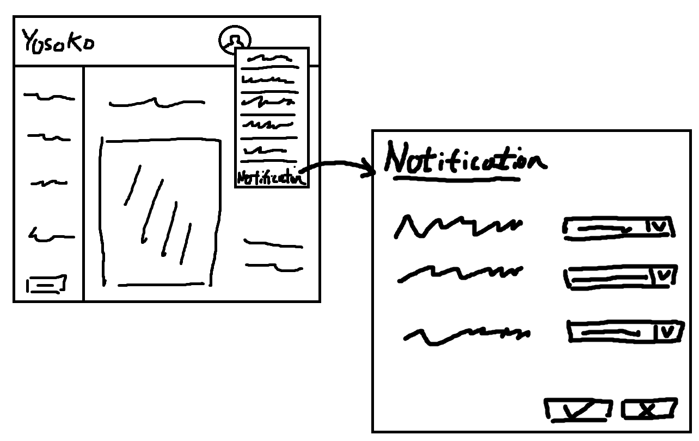

## Synopsis

Git repository created for SEG4105 - lab 4 according to lab instructions.

## Contributors

Tommy Xu - 6427440

## Summary

The Yosoko rental listing service allows tenants to connect with landlords on available property. The in-app messaging feature allows users to communicate via text but there is no way of notifying users of new messages via email or sms, nor set the frequency of them. The solution allows for the notification settings pop-up be accessed via user icon menu and the frequency of notifications in each category to be chosen from never to set frequencies (e.g. daily summaries) to real-time.

## Images

### Fat Marker

