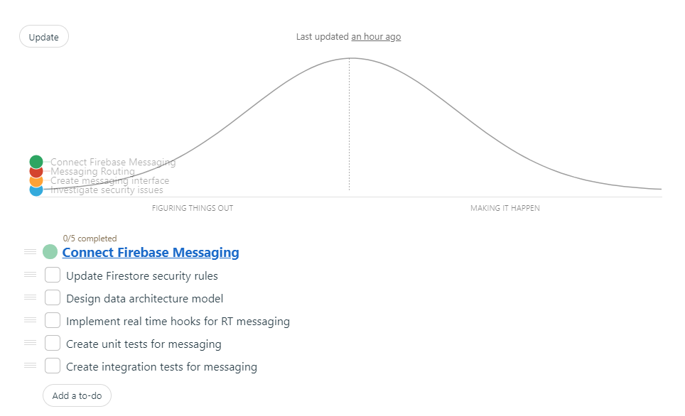
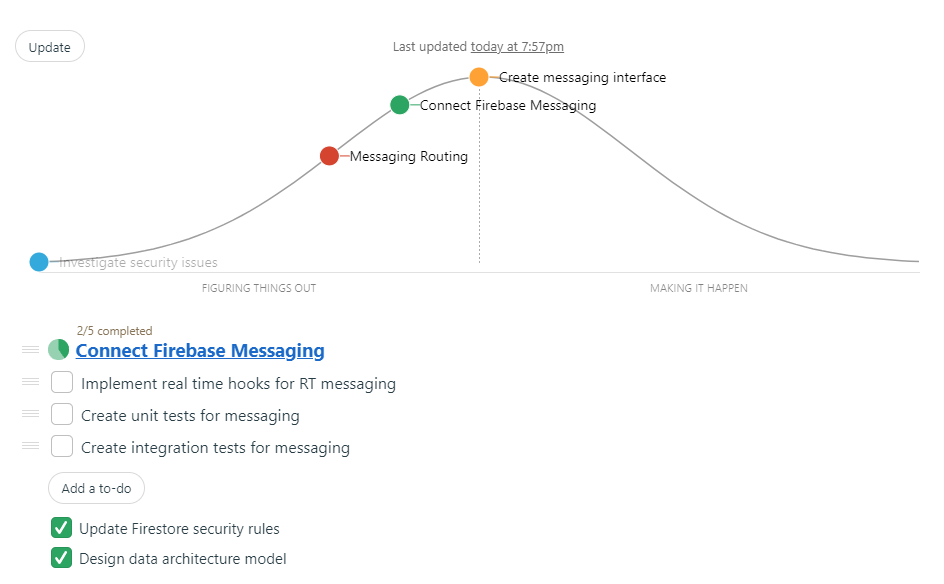
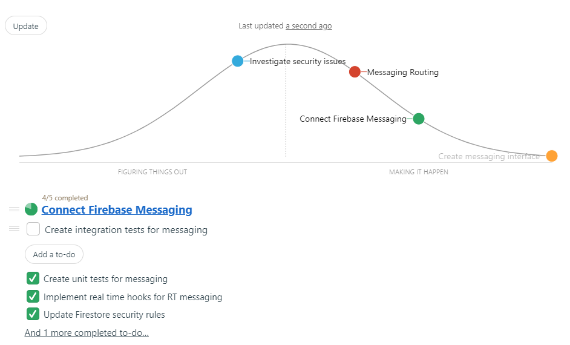

## Synopsis

Git repository created for SEG4105 - lab 6 according to lab instructions.

## Contributors

Tommy Xu - 6427440

## Winning Pitch

In-app Chat Integration by Tommy Deng.

## Problem

Users currently do not have a standardized/built-in form of communication. They (landlords and tenants) have to contact each other through various forms of communication -- which is very unorganized, hard to manage, and an overall unpleasant experience.

## Images

### Hill Charts

Scoped feature = Connect Firebase Messaging

