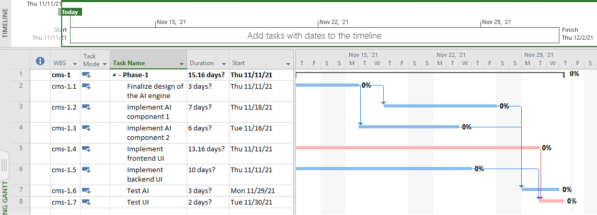
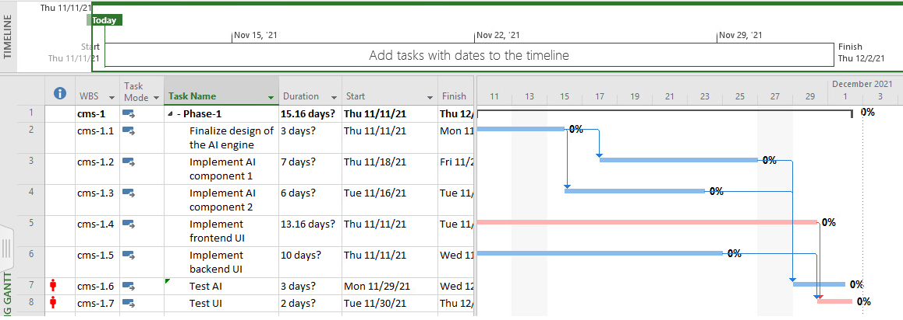
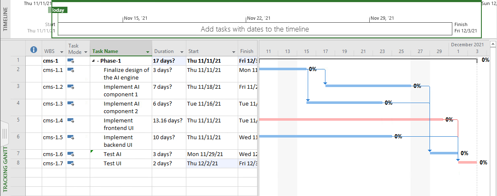

## Synopsis

Git repository created for SEG4105 - lab 8 according to lab instructions.

## Contributors

Tommy Xu - 6427440

## Question Answers

### Task 1

#### Total Cost

The total cost for this iteration is $7,285.79

### Task 2

### Task 3

#### F) Is there any resource allocation problem? If Yes

Yes for Pierre.

#### F.1) What is the problem?

There is not enough resources available for Pierre to work on Test AI and Test UI.

#### F.2) How can you solve this problem?

Use the level resources function to extend the expected start and finish date for Test UI.

#### F.3) Apply your solution (saved as lab08f.mpp)

See lab08f.mpp file.

#### F.4) Take a snapshot of the tasks and Gantt chart (including Critical Path). Submit the snapshot in your report (figure_f).

#### F.5) Compare figure_e and figure_f, and explain your observation.

The start and end date for Test UI has been extended from Nov/30 start date and Dec/2 end date to Dec/2 start date and Dec/3 end date.

### Task 4

#### G) If iteration lengths are 3 calendar-weeks each, what can you deliver, in this iteration?

If iteration lengths are 3 weeks each, I would not assign Pierre on Test AI and be able to deliver the full project by Dec/2. If Pierre is to be assigned to Test AI, all tasks except Test UI will be finished.
